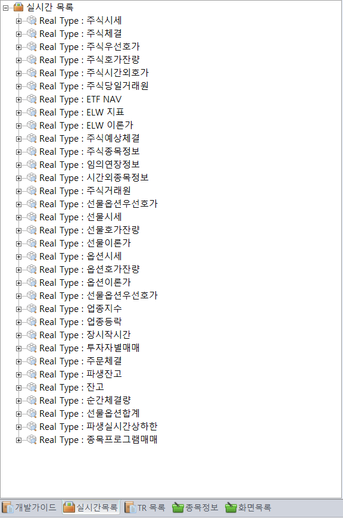
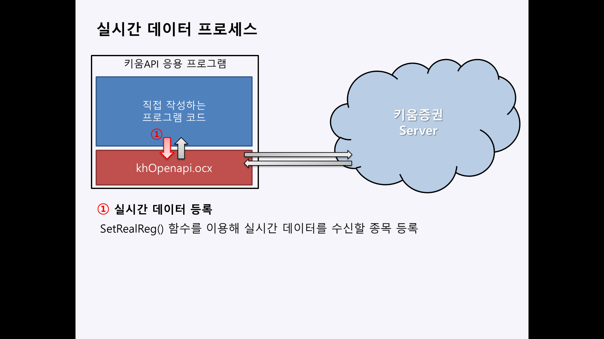
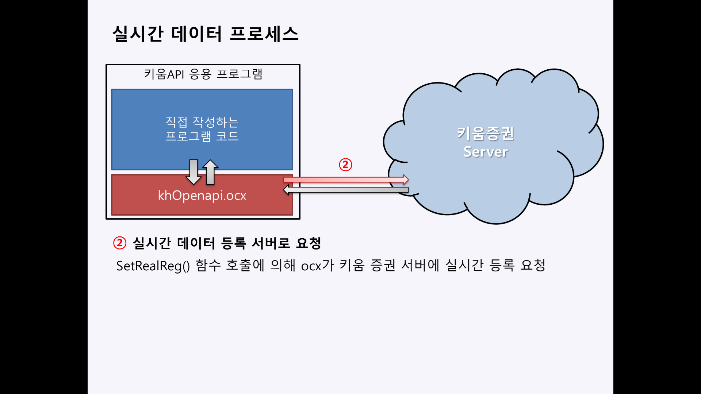
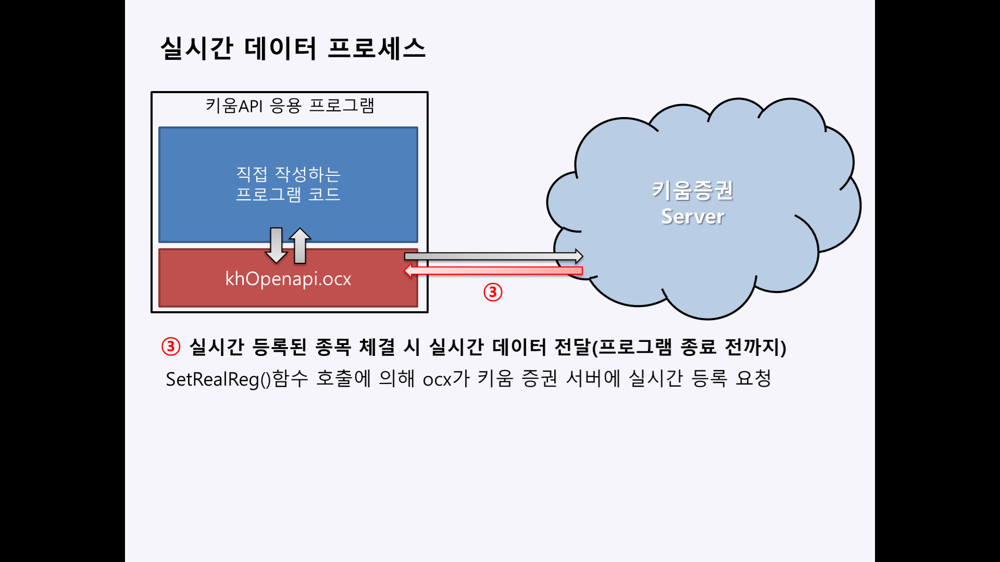
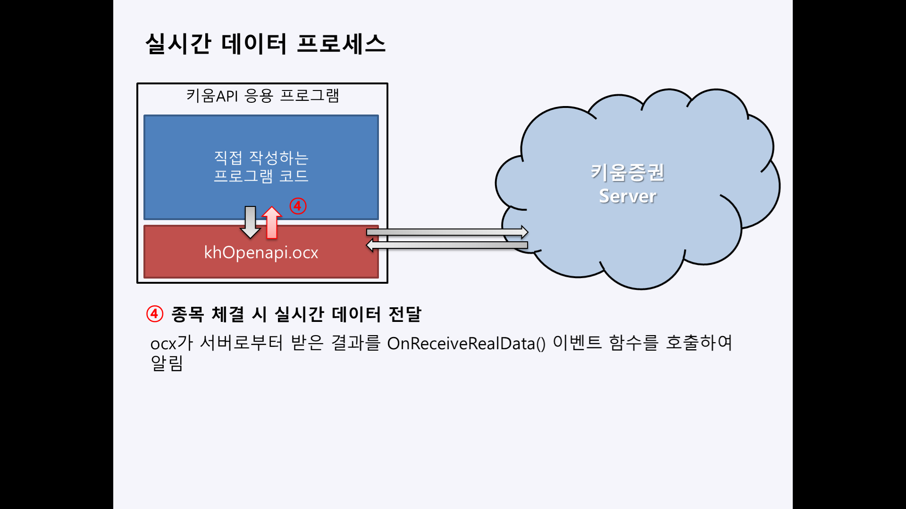
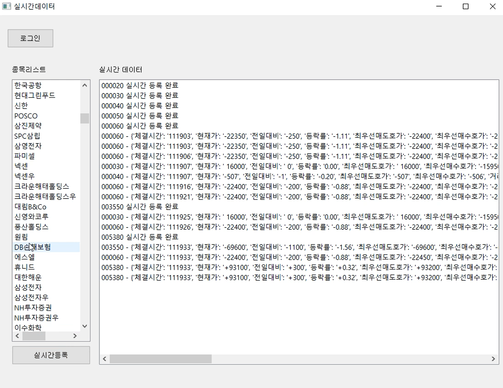

# 실시간 데이터 수신
실시간 데이터 수신 요청이 성공하면 관련 종목의 실시간 데이터가 발생했을때 서버에서 자동으로 OnReceiveRealData()이벤트로 실시간 타입 단위로 전달해줍니다.
KOA Studio의 실시간 탭을 여시면 Real Type과 "주식시세"에서 "종목프로그램매매"까지 나열된 이름을 확인할 수 있습니다.
      



실시간 데이터 프로세스 이해하기
-----------------------------
아래는 키움OpenAPI에서 실시간 데이터를 수신하는 절차입니다.  

#### 1.실시간 종목 등록 함수 호출

>사용자 작성 코드에서 api함수(SetRealReg())를 호출하여 실시간 종목을 등록할 수 있습니다. 
>kiwoomOS를 이용할 경우 addRealData()함수를 호출하면 됩니다.

#### 2.실시간 종목 등록 요청

>OCX가 서버에 실시간 종목 등록을 요청합니다.

#### 3.실시간 데이터 전달

>키움서버가 ocx로 실시간 데이터를 전달합니다. ocx와 키움서버 사이에서 진행되는 절차로 별도의 코드를 작성할 필요는 없습니다.

#### 4.실시간 데이터 수신 Event

>ocx는 키움서버로부터 받은 실시간 데이터를 사용자 작성코드로 전달하기 위해 Event함수를 호출합니다.


실시간 데이터 등록
-----------------
실시간 시세를 받으려는 종목코드 리스트를 이용해서 실시간 시세를 등록하는 해줘야 합니다.
**addRealData()** 함수를 사용해 실시간 종목 등록을 요청을 할 수 있습니다.

종목코드 005930인 종목을 요청할 경우 
```
kwos.addRealData('005930')
```
> * 매개변수1 : 종목코드

여러 종목을 한 번에 요청 할 경우 
```
kwos.addRealData(['005930, 005830, 034230, ...'])
```
> * 매개변수1 : 종목코드 리스트


전체코드:
```
from PyQt5.QtWidgets import *
from PyQt5.QAxContainer import *
from kiwoomOS.kwos import KiwoomOS

class MyWindow(QMainWindow):
    def __init__(self):
        super().__init__()
        kiwoom = QAxWidget("KHOPENAPI.KHOpenAPICtrl.1")
        self.kwos = KiwoomOS(kiwoom)
        self.kwos.addOnLogin(self.kwos_on_login)
        self.kwos.login()

    def kwos_on_login(self, stockItemList, conditionList):
        print('키움서버에 접속되었습니다.')
        self.kwos.addRealData('005930', '005830') #실시간 종목 등록 설정

if __name__ == "__main__":
    app = QApplication([])
    window = MyWindow()
    window.show()
    app.exec_()
```

실시간 데이터 수신 Event
------------------
addRealData()함수를 호출하여 키움증권 서버에 실시간 종목 등록을 요청한 후 해당 종목의 거래가 체결될 때마다 서버로부터 데이터가 전달되며 이 때, OnReceiveReal() 이벤트가 호출됩니다.

이벤트 함수는 addOnReceiveReal() 함수를 통해 등록할 수 있습니다.
```
def kwos_on_receive_real(self, code, data):
    print(code, '종목의 실시간 데이터:', data)
    
kwos.addOnReceiveReal(kwos_on_receive_real)
```
실시간 체결 데이터 수신 이벤트는 호출 시 2개의 값이 전달됩니다.
> * 실시간 체결 종목 코드(code)
>    * 실시간 등록된 종목 중 체결이 발생되어 실시간 데이터가 전달된 종목의 코드
> * 실시간 데이터(data)
>    * Dictionary 구조 - key list : {'체결시간', '현재가', '전일대비', '등락률', '최우선매도호가', '최우선매수호가', '거래량', '누적거래량', '누적거래대금', '시가', '고가', '저가', '전일대비기호', '전일거래량대비', '거래대금증감', '전일거래량대비', '거래회전율', '거래비용', '체결강도', '시가총액', '장구분', 'KO접근도', '상한가발생시간', '하한가발생시간'


전체코드:
```
from PyQt5.QtWidgets import *
from PyQt5.QAxContainer import *
from kiwoomOS.kwos import KiwoomOS

class MyWindow(QMainWindow):
    def __init__(self):
        super().__init__()
        kiwoom = QAxWidget("KHOPENAPI.KHOpenAPICtrl.1")
        self.kwos = KiwoomOS(kiwoom)
        self.kwos.addOnLogin(self.kwos_on_login)
        self.kwos.addOnReceiveReal(self.kwos_on_receive_real)
        self.kwos.login()

    def kwos_on_receive_real(self, code, data):
        print(code, '종목의 실시간 데이터:', data)

    def kwos_on_login(self, stockItemList, conditionList):
        print('키움서버에 접속되었습니다.')
        self.kwos.addRealData('005930', '005830') #실시간 종목 등록 설정

if __name__ == "__main__":
    app = QApplication([])
    window = MyWindow()
    window.show()
    app.exec_()
```

- - -
출력:
```
...
```

관련 함수
--------
#### 실시간 종목 등록
```
kwos.setInput(key, value)
```

#### 실시간 종목 체결 데이터 Event 등록
```
kwos.addOnReceiveReal(func)
```

#### 실시간 기타 데이터 Event 등록
```
kwos.addOnReceiveRealExt(func)
```


샘플 프로그램(realdata.py)
--------------------------

